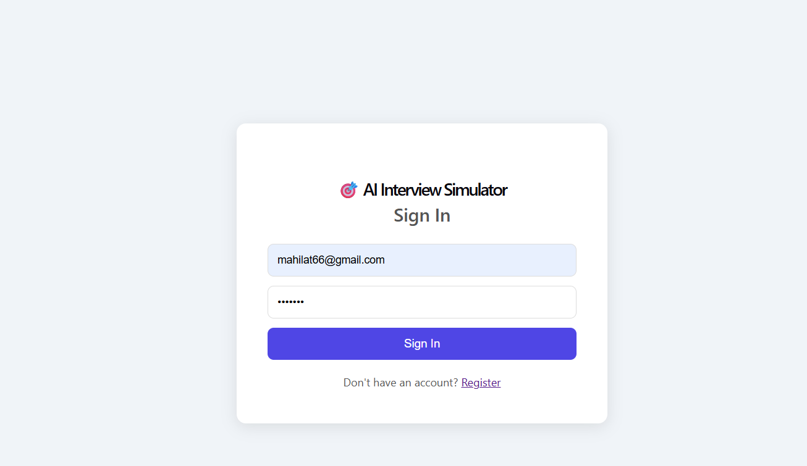
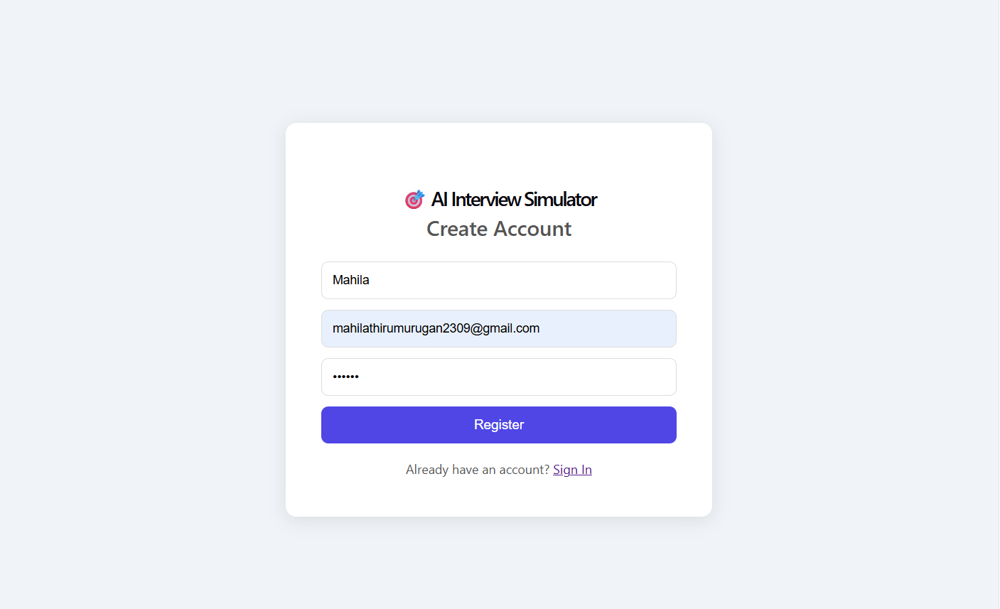
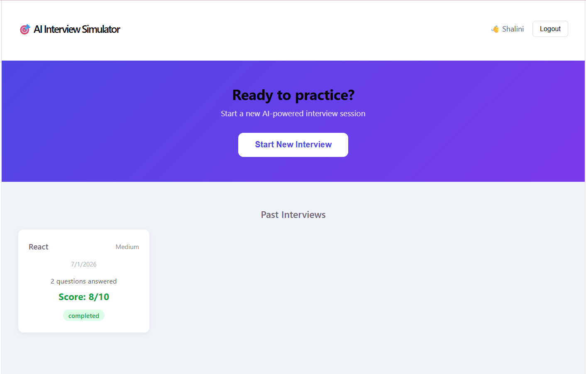
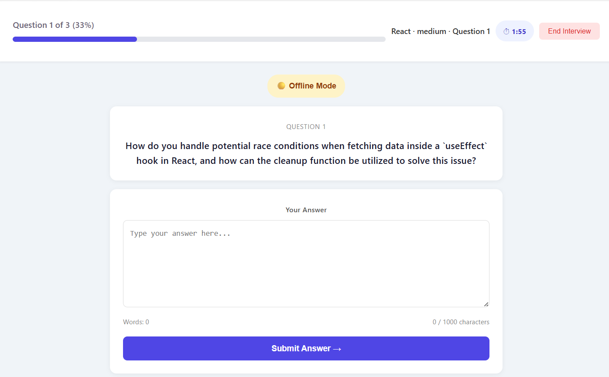
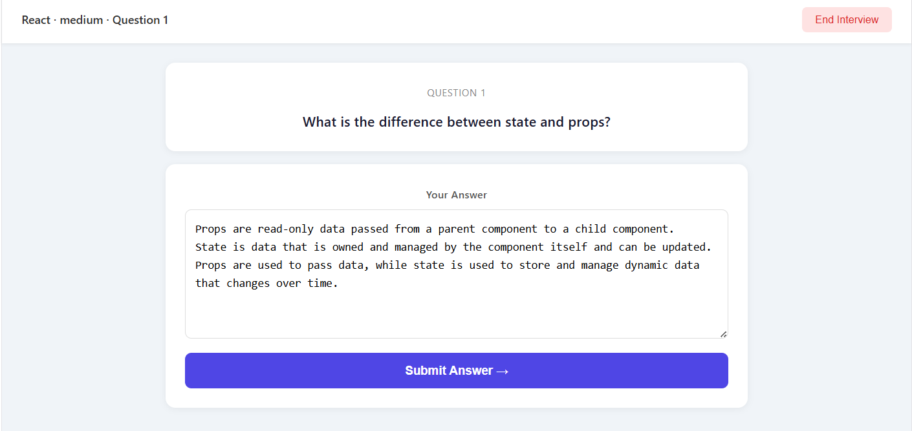
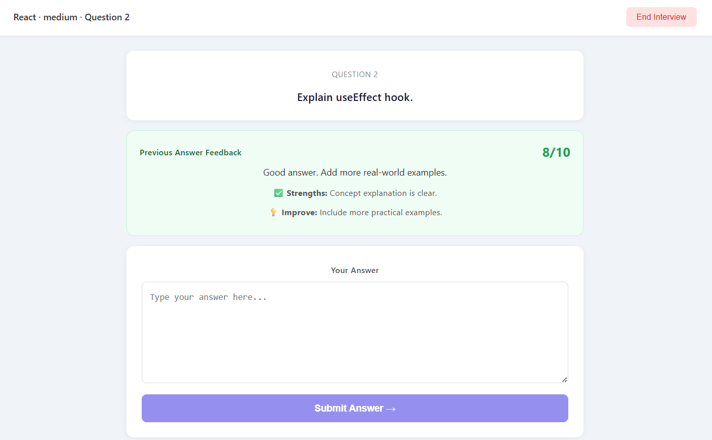
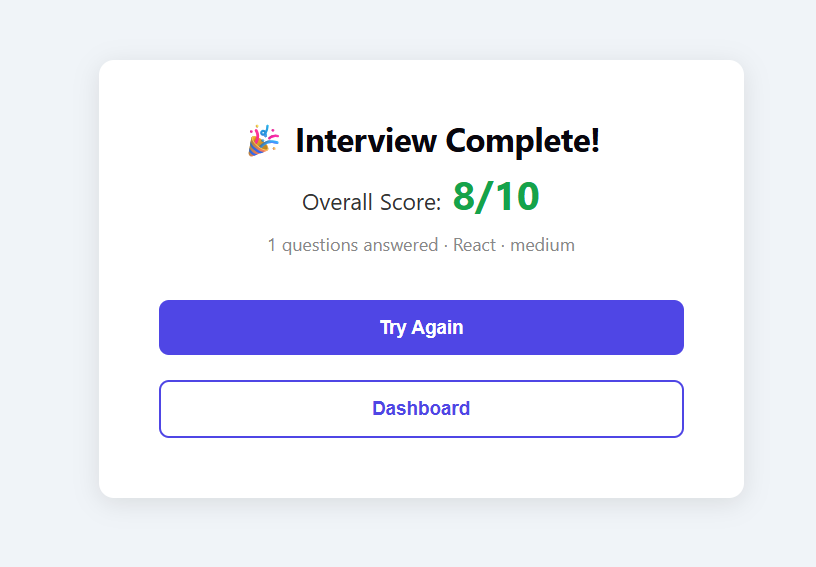

# 🎯 AI Interview Simulator

<h1 align="center">🤖 AI Interview Simulator</h1>

<p align="center">
An AI-powered MERN Stack application that helps users practice technical interviews with Google Gemini AI, secure authentication, interview history, and personalized feedback.
</p>

<p align="center">
<a href="https://interview-simulator-lyart.vercel.app">🌐 Live Demo</a> •
<a href="https://github.com/MAhilaThirumurugan/interview-simulator">💻 GitHub</a>
</p>

<p align="center">
  
  
  
  
  
  
  
  
</p>

---

## 🌐 Live Demo

🚀 https://interview-simulator-lyart.vercel.app

---

# 📌 Project Overview

AI Interview Simulator is a full-stack MERN application that enables users to practice technical interviews using Google Gemini AI. The platform dynamically generates role-specific interview questions, evaluates user responses, and provides personalized feedback. If the Google Gemini API is unavailable or the free-tier quota is exceeded, the application automatically switches to a predefined question set, ensuring uninterrupted interview practice.

Users can:

- Create an account
- Log in securely
- Start AI-powered interview sessions
- Receive role-specific interview questions
- Submit answers and receive AI-generated feedback
- View interview history
- Track interview scores

The application demonstrates MERN Stack development, Google Gemini API integration, JWT authentication, REST APIs, MongoDB Atlas, and cloud deployment using Vercel and Render.

---
---

# ✨ Features

### 👤 Authentication

- User Registration
- Secure Login
- JWT Authentication
- Protected Routes
- Persistent Login

### 🤖 AI Interview Module

- Start New Interview
- AI-generated Interview Questions using Google Gemini API
- Automatic fallback to predefined interview questions when the Gemini API quota is exceeded or unavailable
- Multiple Difficulty Levels
- Topic Selection
- AI-powered Answer Evaluation
- Personalized Feedback
- Interview Completion

### 📊 Dashboard

- Welcome Dashboard
- Previous Interviews
- Interview Score
- Interview Status
- Logout

### ☁️ Cloud Deployment

- Frontend deployed on **Vercel**
- Backend deployed on **Render**
- Database hosted on **MongoDB Atlas**

---

# 🛠️ Tech Stack

## Frontend

- React.js
- React Router
- Axios
- JavaScript
- CSS

## Backend

- Node.js
- Express.js
- Google Gemini API
- JWT
- bcrypt.js
- Express Validator

## Database

- MongoDB Atlas
- Mongoose

## Deployment

- Vercel
- Render

---

# 📂 Project Structure

```
interview-simulator
│
├── client
│   ├── src
│   │
│   ├── components
│   ├── context
│   ├── pages
│   ├── services
│   ├── App.jsx
│   └── main.jsx
│
├── server
│   ├── config
│   ├── controllers
│   ├── middleware
│   ├── models
│   ├── routes
│   ├── validators
│   ├── app.js
│   └── server.js
│
└── README.md
```

---

# 📸 Screenshots

## Login Page



---

## Register Page



---

## Dashboard



---

## Interview Session









---

## Interview History


---

# ⚙️ Installation

## Clone Repository

```bash
git clone https://github.com/MAhilaThirumurugan/interview-simulator.git
```

---

## Frontend Setup

```bash
cd client
npm install
npm run dev
```

---

## Backend Setup

```bash
cd server
npm install
npm start
```

---

# 🔧 Environment Variables

## Server (.env)

```env
PORT=5000
MONGO_URI=your_mongodb_connection_string
JWT_SECRET=your_secret_key
JWT_EXPIRES_IN=7d
CLIENT_URL=http://localhost:5173
GEMINI_API_KEY=your_google_gemini_api_key
```

---

## Client (.env)

```env
VITE_API_URL=http://localhost:5000/api
```

---

# 🔐 Authentication Flow

1. User registers
2. Password is encrypted using bcrypt
3. User logs in
4. JWT token is generated
5. Token is stored in Local Storage
6. Protected APIs verify JWT
7. User accesses dashboard

---

# 📡 REST API Endpoints

## Authentication

| Method | Endpoint | Description |
|---------|----------|-------------|
| POST | `/api/auth/register` | Register User |
| POST | `/api/auth/login` | Login User |
| GET | `/api/auth/me` | Get Logged-in User |

---

## Interview

| Method | Endpoint |
|---------|----------|
| POST | `/api/interviews/start` |
| POST | `/api/interviews/answer` |
| PATCH | `/api/interviews/:id/end` |
| GET | `/api/interviews/history` |
| GET | `/api/interviews/:id` |

---

# 📚 Concepts Used

- React Context API
- React Hooks
- Protected Routes
- REST API
- JWT Authentication
- Password Hashing
- MongoDB Atlas
- Mongoose ODM
- Middleware
- MVC Architecture
- Environment Variables
- Axios Interceptors
- Cloud Deployment
-  Google Gemini API Integration
- Prompt Engineering

---

# 🚀 Future Enhancements

- Voice Interview Support
- Timer for Interviews
- PDF Report Generation
- Performance Analytics
- Dark Mode
- Email Password Reset
- Admin Dashboard

---

# 👩‍💻 Author

**Mahila T**

Aspiring Full Stack Developer passionate about building scalable web applications using the MERN Stack.

### GitHub

https://github.com/MAhilaThirumurugan

---

# ⭐ Support

If you like this project, consider giving it a ⭐ on GitHub!

---

## 🙏 Acknowledgements

This project was built for learning and practicing full-stack web development concepts, including authentication, REST APIs, cloud deployment, and MongoDB integration.
